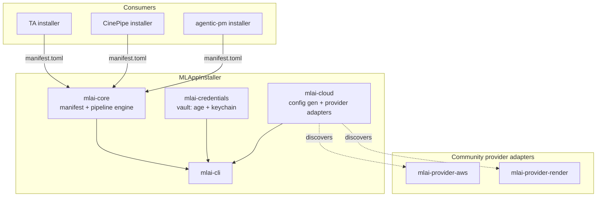
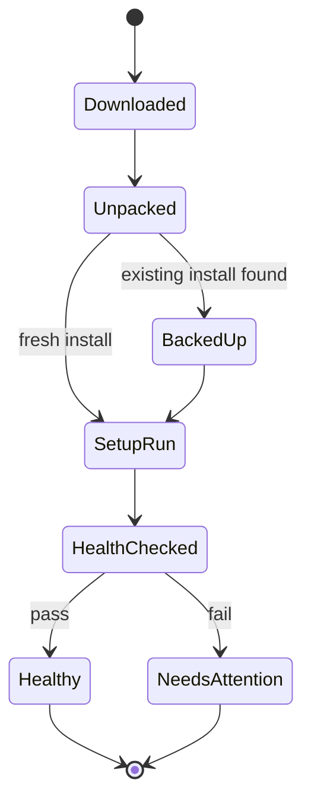
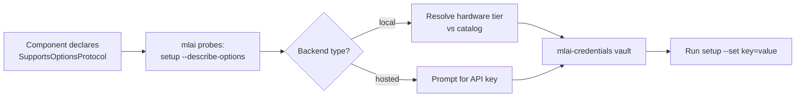

# MLAppInstaller

A generic, reusable, cross-platform installer foundation for agentic apps that need configurable local-vs-cloud model backends at install time. Architecture is confirmed — see [`docs/superpowers/specs/2026-08-14-foundation-design.md`](docs/superpowers/specs/2026-08-14-foundation-design.md) for the full design and [`docs/CONSTITUTION.md`](docs/CONSTITUTION.md) for the behavioral contract governing how this project is built.

## Origin / requirements captured 2026-08-14

Two existing Rust-based installers already solve pieces of this problem independently, and are duplicating effort:

1. **TrustedAutonomy's own installer** (`~/development/TrustedAutonomy/install_local.sh` + `scripts/bump-version.sh`, `scripts/setup-windows-dev.ps1`, `scripts/sign-windows.ps1` etc.) — handles Rust toolchain/binary install, Windows code-signing, cross-platform packaging for TA's own CLI + daemon.
2. **CinePipeAi's installer** (`github.com/CinePipeAi/cinepipe-installer`, private repo) — a Rust-based installer with configurable local vs. API-key hosted model selection at install time for the CinePipeAi pipeline.

Both solve the same underlying problem (cross-platform install, configurable local/cloud model backend selection, secure credential handling at install time) for different products. **MLAppInstaller's purpose**: extract the common foundation from both into one standalone project, so that:
- TA's own installer
- CinePipeAi's installer
- The new `agentic-pm` app's installer (see sibling repo, also scaffolded 2026-08-14 — explicitly wants to build its installer on top of this once ready)

...can all eventually migrate to build on this shared foundation instead of maintaining three parallel implementations.

## Scope (from the founding conversation)

- Cross-platform (matches TA and CinePipeAi's existing cross-platform targets).
- Configurable at install time: local model backend vs. API-key-based hosted model backend — same pattern CinePipeAi already uses, generalized.
- Secure credential handling for the hosted-model-key path — TA's `ta-credentials` crate (age-encryption-at-rest, OS-keychain-first custody, chmod-0600 fallback — see TA's `crates/ta-credentials/src/encryption.rs`) is a proven reference implementation worth reviewing before designing this from scratch.
- Cloud-hosting support: needs to support installing/configuring a daemon/engine for cloud deployment (e.g. Render.com), not just local desktop install — this came up specifically in the context of `agentic-pm`'s cloud-template requirement, but should be a general capability of this installer, not bolted on later.

## Architecture

Four crates, one engine, three surfaces. `mlai-core` owns the manifest schema and the
install pipeline; `mlai-credentials` is TA's proven vault, generalized; `mlai-cloud`
generates deploy config and discovers optional provider adapters; `mlai-cli` is the only
v1 surface (a GUI wizard, rebuilt from cinepipe's Tauri prototype, is a fast-follow, not
v1).

**Per-component install** is a resumable state machine (state persists after every
stage, so a crash mid-install resumes rather than restarts):

**Local vs. cloud backend selection** generalizes cinepipe's Setup Options Protocol
(`--describe-options` / `--set key=value`) beyond CinePipe-specific model "purposes" to
any component's local-vs-hosted choice:

Full rationale, the cloud config-generation flow, and deferred scope are in the
[foundation design spec](docs/superpowers/specs/2026-08-14-foundation-design.md).

## Key decisions (2026-08-14)

- **Absorbs TA's `v0.18.2` roadmap item** (`ta-package` + cross-platform installer) — TA's `PLAN.md` gets a follow-up edit to point at this repo instead of building a parallel extraction.
- **Single Rust codebase, cross-compiled** — not cinepipe's PowerShell/bash script-twin pattern, which drifts.
- **CLI/engine first; GUI is a fast-follow** reusing cinepipe's Tauri prototype.
- **Cloud install v1 = config generation only** (Dockerfile, deploy manifest, secrets template); live provisioning is delegated to community-contributable, externally discovered provider adapters (`mlai-provider-aws`, `mlai-provider-render`, ...) — core ships zero provider-specific code.
- Migration timeline for TA and CinePipeAi's existing installers to adopt this, and the relationship to `agentic-pm`'s installer, are explicit follow-ups — not blocking, done once this foundation is proven.

## Status

Design confirmed 2026-08-14 — see the [foundation design spec](docs/superpowers/specs/2026-08-14-foundation-design.md). Next: Superpowers implementation planning (`writing-plans`), then execution via TA-mediated goals (`.ta/` is already live in this repo — see `CLAUDE.md`). Retrofitting TA's and CinePipeAi's own installers onto this base, and `agentic-pm`'s installer, are explicit follow-up tasks once this foundation lands.
