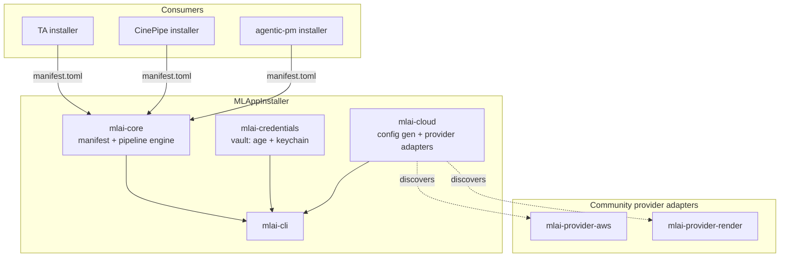
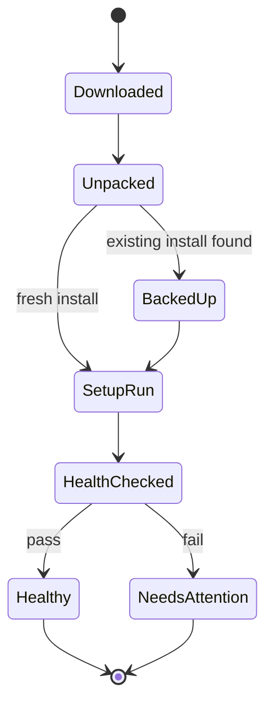
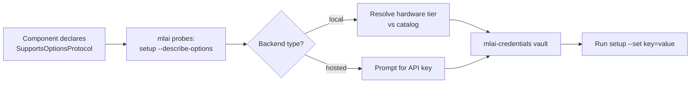
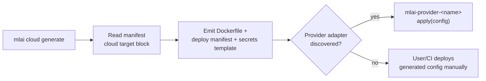

# MLAppInstaller: Foundation Design

**Status**: Approved 2026-08-14 (architecture confirmed by user; ready for implementation planning)
**Supersedes**: TA `PLAN.md` roadmap item `v0.18.2 — Extract ta-package + Cross-Platform Installer` (see "Relationship to TA's roadmap" below)

**Amendment, 2026-08-15**: the `mlai-credentials` crate described below (an installer-owned encrypted vault, ported from TA's `ta-credentials`) was built, then reverted — an installer that stores secret values is solving the wrong problem; see `docs/CONSTITUTION.md` §2.1 and `docs/superpowers/specs/2026-08-15-credential-source-glue-design.md` for the corrected, on-hold direction (the installer passes through a credential *reference* via the existing backend-options protocol; it never touches the value). References to `mlai-credentials` below are historical context for that decision, not current architecture. The same day, a mature, tested Rust installer implementation was found on cinepipe-installer's `feat/unified-rust-installer` branch — its proven algorithms (guarded removals, repair, per-platform setup/health) are being ported into `mlai-core` rather than re-derived from scratch; see that plan's own notes for what's ported vs. generalized.

## Problem

Two real, working Rust-based installers solve overlapping pieces of the same problem
independently:

- **TA's own installer** (`install.sh`, `install_local.sh`) — single-binary fetch/build,
  no component graph, but has a proven credential vault (`ta-credentials`: age
  encryption, OS-keychain-first, chmod-0600 fallback).
- **cinepipe-installer** — a manifest-driven, multi-component pipeline
  (download → unpack → setup → health-check → backup), idempotent/resumable install
  state, versioned "removals" for upgrade cleanup, and a genuinely reusable **Setup
  Options Protocol** (`--describe-options` / `--set key=value`) for local-vs-hosted
  model selection. Its cross-platform story is two separately maintained script twins
  (`install.ps1` PowerShell + `install.sh` bash) that can and do drift.

Both are duplicating effort that a third consumer (`agentic-pm`, cloud-deploy use case)
is about to duplicate a third time. MLAppInstaller extracts the shared foundation once,
generalized beyond CinePipe-specific concepts, so TA, CinePipe, and `agentic-pm` become
consumers instead of parallel implementations.

## Decisions

These were open forks (the README's "Explicitly NOT decided yet" section) resolved
during design review:

1. **Absorbs TA's `v0.18.2` roadmap item.** TA's `PLAN.md` already planned to extract
   `ta-package` + a cross-platform installer — same problem this project solves.
   MLAppInstaller becomes that extraction. TA's `PLAN.md` gets a follow-up edit (outside
   this repo) pointing `v0.18.2` at adopting MLAppInstaller instead of building a
   parallel `ta-package`.
2. **Single Rust codebase, cross-compiled** — not cinepipe's PowerShell/bash twin
   pattern. Eliminates the exact script-drift problem cinepipe has today. Matches TA's
   existing stack, enabling direct reuse of `ta-credentials`.
3. **CLI/engine first; GUI is a fast-follow.** v1 ships `mlai-core` + `mlai-cli` as a
   solid, testable foundation. The Tauri wizard (cinepipe's prototype, not yet its
   default customer path) gets rebuilt as a thin shell over the CLI in a later phase.
4. **Cloud install, v1 scope = config generation, not live provisioning.** `mlai cloud
   generate` produces a deploy bundle (Dockerfile, deploy manifest, secrets template).
   Actually deploying to a specific provider (AWS, Render.com, ...) is delegated to
   **external, community-contributable provider adapters** — discoverable plugins that
   consume the generated config and execute against one provider's API/CLI. Core never
   ships provider-specific code.

Full rationale for each is in `docs/CONSTITUTION.md` §1 and §4.

## Architecture

Four crates:

- **`mlai-core`** — manifest schema (components, refs, setup commands, health checks,
  removals — generalized from `manifest.psd1`/`.json`), the
  download → unpack → setup → health → backup pipeline, idempotent `installed.json`
  state tracking, and the generalized backend-option protocol (cinepipe's
  `--describe-options`/`--set key=value`, generalized beyond CinePipe's "purposes"
  vocabulary to any local-vs-hosted choice a component wants to expose).
- **`mlai-credentials`** — `ta-credentials`'s vault (age + OS-keychain-first +
  chmod-0600 fallback), generalized so the keyring service/namespace is a caller
  parameter instead of hardcoded to `trusted-autonomy-vault`.
- **`mlai-cloud`** — deploy-config generation plus the provider-adapter protocol
  (same describe/apply JSON-over-stdio shape as the backend-option protocol, applied to
  "take this config and deploy it to provider X").
- **`mlai-cli`** (`mlai` binary) — v1's only surface: `mlai install|repair|uninstall|update`
  for local components, `mlai cloud generate` for the config-only cloud path. This is
  what TA's own installer becomes, and what CinePipe/`agentic-pm` eventually vendor or
  shell out to.

## Install pipeline (per component)

Resumable state machine, lifted from cinepipe's proven design (constitution §3.1–3.3):

State persists after every stage (crash-safe resume). Backups keep the last 3. Versioned
`removals` entries handle cross-version structural cleanup (renamed/deprecated paths),
guarded so a removal path must resolve inside the install root.

## Local vs. cloud backend selection

Generalizes cinepipe's Setup Options Protocol + model-catalog pattern so any component's
manifest can declare local-vs-hosted choices, not just CinePipe's model "purposes":

A component that doesn't implement the protocol behaves exactly as it does today — the
CLI falls back to running setup with no extra options. Probing is gated behind an
explicit manifest flag (`supports_options_protocol: true`), never a blind probe, matching
cinepipe's own safety rationale (calling `--describe-options` on a script that doesn't
recognize the flag could silently trigger real side effects).

## Cloud config generation

Provider adapters are discovered the same way cinepipe discovers setup scripts:
`.mlai/providers/`, `$PATH` prefix `mlai-provider-`. An adapter is a separate executable;
core has zero knowledge of AWS, Render, or any other provider's API.

## What's explicitly deferred

- **TA and CinePipe retrofitting onto this base** — separate follow-up tasks. Both
  should eventually reduce to a `manifest.toml` plus adapters, but that migration isn't
  part of this repo's implementation plan.
- **GUI wizard** — fast-follow phase; reuses cinepipe's Tauri prototype and lessons.
- **Live cloud provisioning** — v1 only generates config. Provider adapters that call a
  provider's API are a later, community-extensible layer, not built as part of this
  plan.
- **TA's `PLAN.md` v0.18.2 rewrite** — a follow-up edit in the TA repo, not part of this
  implementation plan.
- **`agentic-pm`'s installer** — scaffolded in parallel; explicitly not blocked on this
  landing first, and not part of this plan.

## Relationship to TA's roadmap

TA's `PLAN.md` §`v0.18.2` currently reads "Extract the release pipeline and installer
scaffolding from TA into a standalone `ta-package` crate...". Once this design is
implemented, that item should be rewritten to describe TA adopting `mlai-core` +
`mlai-cli` (and vendoring `mlai-credentials` in place of `ta-credentials` duplication)
rather than building a separate `ta-package`. That edit happens in the TA repo as a
follow-up task, not here.

## Testing strategy

Per `docs/CONSTITUTION.md` §5 and cinepipe's own precedent (`test/selftest.ps1`):
archive/download round-trip against a small public repo, manifest parse/validate,
`installed.json` state round-trip, health-check evaluation, guarded-removal path
validation, and backup/restore — without invoking any real component's heavy setup.
Credential vault tests use a mock keyring backend plus the real chmod-0600 fallback path
under `tempfile::tempdir()`.

## Additional decisions

- **Manifest format: TOML.** Matches Rust-ecosystem convention and `ta-credentials`'s
  own config style. This is a new project, not a migration of an existing manifest, so
  there's no reuse benefit to cinepipe's PowerShell-native `.psd1` shape.
- **Backend-option protocol flags are verbatim cinepipe compatible**: `mlai-core` calls
  `--describe-options` / `--set key=value`, the exact flag names cinepipe already uses.
  Any component that already implements cinepipe's protocol needs zero changes to work
  under `mlai-core`.
