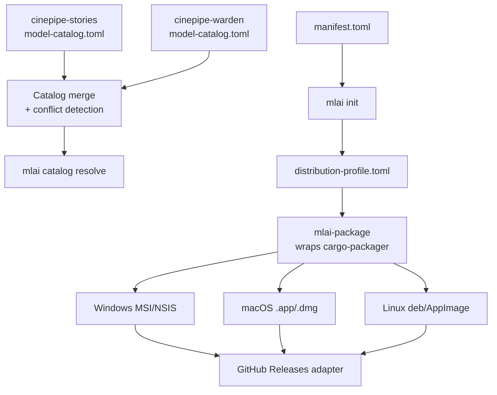

# Distribution Packaging Framework: Design

**Status**: Approved 2026-08-15 (architecture confirmed by user; ready for implementation planning)
**Extends**: `docs/superpowers/specs/2026-08-14-foundation-design.md`. Refines that spec's deferred "cloud config generation" scope: `mlai-cloud` (separately deferred, untouched by this doc) is about deploying the *installed product* to a cloud **runtime**. This document is about packaging and distributing the *installer itself* to a **target machine** — a different concern that happened to share the word "deploy."

## Problem

MLAppInstaller's founding scope names "configurable local-vs-cloud model backend selection at install time" as core, but nothing built so far treats *which ML models/tools ship in a given distribution* as a first-class packaging concern — it's been implicit, left to each component's own setup script. Separately, this project was asked to be a reusable foundation, not a shipped product: neither TA nor cinepipe needs MLAppInstaller to have its own release pipeline — they need a **framework that makes it easy for them to build their own distributions**: which components/models are included, for which target machines, packaged into which native installer format, signed how, published where.

CinePipe's own prior art (`model-catalog.json`) already solved the "two components silently disagree about which model fits a given machine" problem — but did so assuming a single team could author one canonical file. CinePipe today is a loose collection of sub-projects (cinepipe-director, cinepipe-warden, cinepipe-stories, ...) with no such central authority, and the fix needs to account for that.

## Scope

**In scope:**
- A model catalog mechanism in `mlai-core`: ownership-tagged catalog fragments from multiple independently-developed sub-projects, merged with conflict detection (not silent coalescing) — and a structured hardware profile (OS, GPU vendor, VRAM, effective VRAM after derating, disk) rather than VRAM alone.
- A new `mlai-package` crate: an adopter-authored **distribution profile** (which components, which platforms, which packaging format, signing-identity *references*, deploy target), wrapping `cargo-packager` to actually produce native installers (Windows MSI/NSIS, macOS .app/.dmg, Linux deb/AppImage) rather than reimplementing installer-format generation.
- A `GitHub Releases` deploy adapter (the one real, working destination for v1) behind a pluggable trait.
- `mlai init`: a guided CLI wizard for the *adopter* (a TA or cinepipe engineer configuring their distribution) — not an end-customer-facing GUI installer.

**Explicitly out of scope** (deferred, not gaps):
- End-customer GUI installer (already deferred as a fast-follow phase in the foundation spec).
- Certificate/notarization-credential *acquisition* — the target project's own responsibility. This framework only accepts signing-identity *references* and shells out to the platform's own signing tool.
- Cloud runtime deployment (`mlai-cloud`) — separate, already-deferred concern.
- Remote-version detection, the credential-source glue design — both already deferred elsewhere.
- **Real cross-platform hardware auto-detection** (parsing `nvidia-smi`, Metal/`system_profiler`, WMI). Today, every cinepipe component already does its own hardware detection inside its own setup script; this framework's catalog *resolver* accepts a `HardwareProfile` as input without caring how it was produced. A `mlai hardware detect` auto-detection utility is a valuable, real, separately-scoped follow-up — not required for the catalog/merge/resolve mechanism to work or be tested.

## Architecture

### 1. Model catalog (`mlai-core`)

**The ownership problem, and why merge-with-conflict-detection instead of a single file or silent coalescing:** CinePipe's existing catalog assumes one author. In reality, `cinepipe-warden` might independently determine a better model for a hardware tier with no central team to update a shared file. The fix is **catalog fragments with explicit per-purpose ownership**:

```toml
# cinepipe-stories's model-catalog.toml fragment
[purposes.text-structured-json]
owner = "cinepipe-stories"

[[purposes.text-structured-json.tiers]]
min_vram_gb = 24
model = "qwen3:32b"

[[purposes.text-structured-json.tiers]]
min_vram_gb = 8
model = "qwen3:8b"
```

At resolve time, every fragment referenced by the components being packaged is loaded and merged:
- Same purpose, same owner, identical tier data across fragments → fine (harmless redundant declaration).
- Same purpose, **different** tier data from a **non-owning** fragment → **hard error**, loud and actionable, naming both fragments and the conflicting values. This is the exact failure mode that caused cinepipe's original bug (two products independently inventing different tier tables for the same purpose) — the framework refuses to let it happen silently rather than trying to reconcile it automatically.
- A fragment may *reference* a purpose it doesn't own (declare "I consume this") without redefining its tiers.

This means a sub-project either owns the purpose it wants to change (updates its own fragment, no coordination needed) or doesn't (contributes the change back to the owning fragment as a real cross-project change) — never a silent local override.

**Hardware profile — more than VRAM:**
```rust
pub struct HardwareProfile {
    pub os: Os,                    // Windows | MacOS | Linux
    pub gpu_vendor: GpuVendor,      // Nvidia | Amd | Apple | Intel | None
    pub vram_gb: f64,               // raw detected
    pub effective_vram_gb: f64,     // after platform-specific derating
    pub disk_free_gb: f64,
}
```

`effective_vram_gb` generalizes two concepts CinePipe's own catalog comments already named but hadn't formalized: **Apple Silicon unified-memory derating** (the exact axis that caused their original bug) and **reservation** (subtracting headroom for a co-resident heavy GPU consumer like Unreal Engine — their catalog's comment explicitly says this was "not built yet"; this design completes it as a resolver parameter, `reserve_vram_gb`, rather than each product hand-rolling its own math).

A tier entry may declare optional constraints beyond `min_vram_gb` — `requires_vendor: Option<Vec<GpuVendor>>`, `requires_os: Option<Vec<Os>>` — since capability isn't just capacity (an MLX build is Apple-only; a CUDA-specific quantization needs Nvidia). A tier failing its constraints is skipped, falling through to the next tier that qualifies.

**CLI utility, not a mandated dependency:** `mlai catalog resolve --purpose <p> --catalog <path> --hardware-profile <json>` — any component's setup script, in whatever language it's already written in, can shell out to this instead of hand-rolling tier logic. Adoption is additive, matching the backend-options protocol's own "components that don't use it behave exactly as today" posture — never required.

### 2. Distribution packaging (`mlai-package`, new crate)

An adopter authors a **distribution profile** (TOML) — not a Rust program, not a CI script from scratch:

```toml
[distribution]
name = "cinepipe-director-suite"
manifest = "manifest.toml"          # which components/subset
components = ["cinepipe-director", "ue5-cine-pipeline"]

[[targets]]
platform = "windows"
format = "msi"
sign.identity_ref = "cert:thumbprint:AB12CD34..."   # reference only

[[targets]]
platform = "macos"
format = "dmg"
sign.identity_ref = "keychain:Developer ID Application: CinePipeAi, Inc."
notarize.apple_id_ref = "env:APPLE_ID"
notarize.team_id_ref = "env:APPLE_TEAM_ID"

[deploy]
adapter = "github-releases"
repo = "CinePipeAi/cinepipe-director"
```

`mlai-package` wraps `cargo-packager` (confirmed via research: a standalone, config-driven packager — not Tauri-only — that already packages arbitrary executables + resource files, not just GUI apps, and already produces Windows MSI/NSIS, macOS .app/.dmg, and Linux deb/AppImage from one config) rather than reimplementing installer-format generation, consistent with `docs/CONSTITUTION.md` §1.6 (Reuse Before Reinventing). `mlai-package` shells out to the `cargo packager` CLI — the same "orchestrate an already-built external tool" pattern already used for component setup commands — rather than depending on it as a library, keeping the integration simple and matching how this project already treats external tooling.

**Signing is reference-only, confirmed as the ecosystem norm, not something to invent:** `cargo-packager` itself doesn't sign or notarize — it shells out to `codesign`/`signtool`/`notarytool` given an identity reference. Verified directly against `cargo-packager` 0.11.8 (installed and run locally, not just documentation): macOS signing takes a `signingIdentity` string (a keychain identity name, e.g. `"Developer ID Application: CinePipeAi, Inc."`), with notarization credentials (`APPLE_ID`/`APPLE_PASSWORD`/`APPLE_TEAM_ID`) taken from environment variables only — not settable via config at all. Windows signing is **certificate-store-thumbprint-based only** (`certificateThumbprint`), not PFX-path/password-based — there is no PFX+password config field in `cargo-packager`'s `WindowsConfig`, so a distribution profile targeting Windows assumes the signing certificate is already installed in the build machine's certificate store. `mlai-package`'s distribution profile only ever carries these references (identity name, thumbprint) — never a secret value. Actual secret material (the notarization app password, the cert's own private key custody) lives in the adopter's own CI secret store / OS certificate store — the same principle already established for credentials in `docs/CONSTITUTION.md` §2.1, applied to a second domain.

**Deploy** is a small trait (`DeployAdapter::publish(artifacts, config) -> Result<...>`) with one real implementation, `GitHubReleasesAdapter`, for v1 — both TA and cinepipe already publish there today. Built behind the trait from the start so a second destination later is an addition, not a redesign, matching the same posture as the already-deferred cloud provider adapters.

### 3. Guided setup (`mlai init`)

An interactive CLI wizard for the *adopter* — a TA or cinepipe engineer, not an end customer. Walks through: which components from an existing `manifest.toml` to include, target platforms, packaging format per platform, signing-identity references (prompts for the reference string, never a secret), deploy target — and writes the distribution profile. No GUI, no deep packaging/Rust knowledge required to produce a working distribution config.



## Decisions

1. **Setup-wizard audience is the adopter**, not the end customer — the end-customer GUI installer remains a separately-deferred fast-follow phase.
2. **Model catalog generalizes cinepipe's mechanism (ownership + shared resolution), not its data.** Each adopting project authors its own catalog fragments for its own domain; cross-project data sharing between e.g. TA and CinePipe isn't meaningful since their model needs differ.
3. **Ownership-tagged fragments merged with hard-error conflict detection**, not a single central file and not silent coalescing — this is the mechanism that actually prevents the fragmentation bug recurring in a multi-repo world with no central authority.
4. **Hardware profile is structured** (OS, GPU vendor, raw + effective VRAM, disk), not VRAM alone; tiers may declare vendor/OS constraints.
5. **Native installers are the actual goal**, not archive bundles — wrapping `cargo-packager` rather than reimplementing per-platform installer formats.
6. **Signing is support, not implementation** — the framework accepts identity references and shells out to platform signing tools; certificate acquisition and custody stay the adopter's responsibility.
7. **GitHub Releases only for v1, built behind a pluggable `DeployAdapter` trait** so a second destination is additive later.
8. **Hardware auto-detection is out of scope for this design** — the resolver takes a `HardwareProfile` as input; today's status quo (each component detects its own hardware) is unaffected until a dedicated `mlai hardware detect` follow-up exists.

## Open technical risks (to resolve during implementation planning, not hand-waved here)

- `cargo-packager`'s exact CLI invocation shape and config file format need direct verification against its current docs before writing task-level code (this design's own research pass confirmed it exists and fits, but didn't pin exact CLI flags).
- Windows CI runners' preinstalled WiX version may need explicit pinning; `cargo-wix`/`cargo-packager`'s WiX dependency should be verified against whatever GitHub's `windows-latest` image currently ships.
- The merge-conflict error format (what exactly gets shown when two fragments disagree) needs concrete design during planning, not left implicit.

## Relationship to the TA/CinePipe migration mapping

Per explicit sequencing: this framework is designed and built first. Once it exists, a separate mapping document — not part of this spec — will show concretely what in TA's and CinePipe's existing installers/catalogs maps onto it, and what each project would delete.
